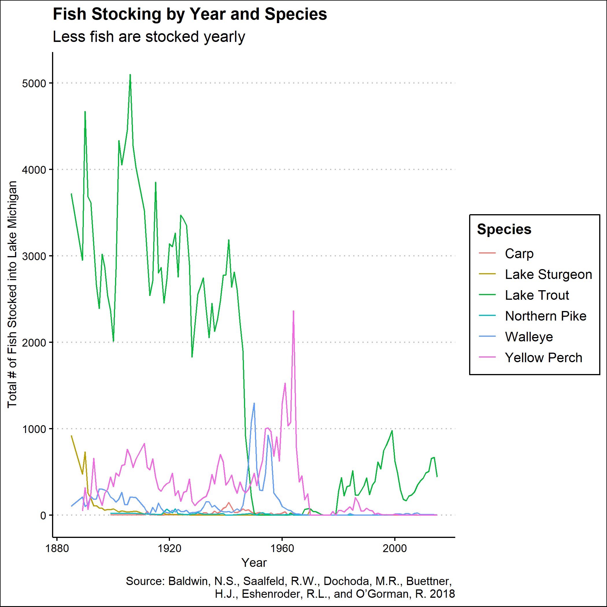

```{r setup, include=FALSE}
knitr::opts_chunk$set(echo = FALSE)
library(tidyverse)
library(ggthemes)
library(knitr)
library(readxl)
library(dplyr)
library(plotly)
library(rvest)
# Learn more about creating websites with Distill at:
# https://rstudio.github.io/distill/website.html

# Learn more about publishing to GitHub Pages at:
# https://rstudio.github.io/distill/publish_website.html#github-pages
```
```{r}
michigan <- read_excel("michigan.xlsx", col_types = c("numeric", 
                   "text", "text", "numeric", "numeric", 
                  "numeric", "numeric", "numeric", "numeric", 
                   "numeric", "numeric", "numeric", "text", 
                   "numeric", "numeric", "numeric"))
```


```{r}
fish_plot <- michigan |> 
  as_tibble(michigan)
rename(michigan, mi_total = "MI State Total") |> 
  select(Year, Species, mi_total) |> 
  filter(Species %in% c("Carp", "Walleye", "Yellow Perch", "Lake Sturgeon", "Lake Trout", "Northern Pike")) |> 
  drop_na() |> 
  ggplot(mapping = aes(x = Year, 
                       y = mi_total, 
                       color = Species)) +
  geom_line() +
  scale_y_continuous(breaks = c(0, 500, 1000, 1500, 2000, 2500, 3000, 3500, 4000, 4500, 5000, 5500)) +
  theme_clean() +
  labs(title = "Fish Stocking by Year and Species", 
       subtitle = "Less fish are stocked yearly", 
       x = "Year", 
       y = "Total # of Fish Stocked into Lake Michigan", 
       caption = "Source: Baldwin, N.S., Saalfeld, R.W., Dochoda, M.R., Buettner, 
       H.J., Eshenroder, R.L., and O’Gorman, R. 2018")
```

```{r fish-plot}


#ggsave("fish-plot.png", width = 9, height = 9)
```

```{r image}
#
```


